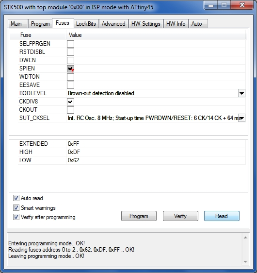

# iod-nodes

ESP8266 based MQTT nodes controlled by Attiny.

This project covers battery powered WiFi devices running MQTT. The design goal was extremely low standby current for very long battery life.

The Attiny 25 in deep sleep consumes 120 nA. An interrupt on port change (mechanical switch) starts the Attiny which then switches on the Vcc of the ESP8266 via an MOSFET. After successfully connecting the WiFi and the MQTT broker and transmitting the current status the ESP8266 is shut down and the Attiny goes back into deep sleep.
The circuit supports supply by three Eneloop accumulators as well as by two alkaline primary cells.

